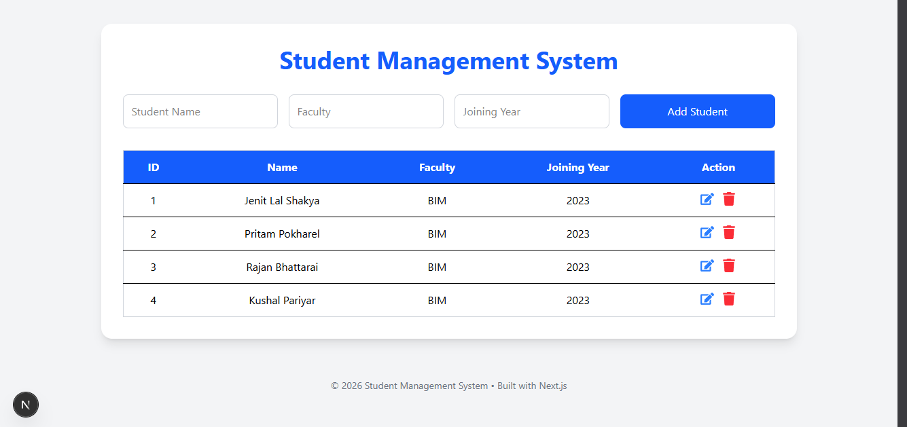

# 🎓 Student Management System

A simple full-stack Student Management System built with **Next.js (App Router)**, **MySQL**, and **Tailwind CSS**.  
This project demonstrates basic CRUD operations (Create, Read, Update, Delete) with a REST API connected to a database.

---

## 🚀 Features

- Add new students
- View all students in a table
- Update student details
- Delete student records
- Real-time UI updates after database changes
- Clean and responsive UI using Tailwind CSS

---

## 🛠️ Tech Stack

- **Frontend:** Next.js (React, App Router)
- **Backend:** Next.js API Routes
- **Database:** MySQL (XAMPP / Local server)
- **Styling:** Tailwind CSS
- **Language:** TypeScript

---

## 📁 Project Structure

```
student-management-system/
│
├── app/
│   ├── page.tsx
│   └── api/
│       └── students/
│           ├── route.ts
│           └── [id]/
│               └── route.ts
│
├── components/
│   ├── StudentForm.tsx
│   ├── StudentTable.tsx
│   ├── UpdateStudentForm.tsx
│   └── Footer.tsx
│
├── lib/
│   └── db.ts
│
└── types.ts
```

---

## ⚙️ Setup Instructions

### 1. Clone the repository

```bash
git clone https://github.com/jenitlalshakya/student-management-system.git
cd student-management-system
```

---

### 2. Install dependencies

Install pnpm if not already installed:

```bash
npm install -g pnpm
```

Then install project dependencies:

```bash
pnpm install
```

---

### 3. Setup MySQL database (XAMPP)

Create a database:

```sql
CREATE DATABASE student_db;

USE student_db;

CREATE TABLE student_records (
  id INT AUTO_INCREMENT PRIMARY KEY,
  name VARCHAR(100) NOT NULL,
  faculty VARCHAR(100) NOT NULL,
  joining_year YEAR NOT NULL
);
```

---

### 4. Configure environment variables

Create a `.env` file:

```env
DB_HOST=localhost
DB_USER=root
DB_PASSWORD=
DB_NAME=student_db
```

---

### 5. Run the project

```bash
pnpm run dev
```

Open:

```
http://localhost:3000
```

---

## 📌 API Endpoints

### Students

* `GET /api/students` → Get all students
* `POST /api/students` → Add student

### Single Student

* `PUT /api/students/[id]` → Update student
* `DELETE /api/students/[id]` → Delete student

---

## 🧠 Learning Purpose

This project was built to practice:

* Next.js API routes
* MySQL integration
* CRUD operations
* State management in React
* Form handling
* Component-based architecture

---

## 📸 Screenshots



---

## 📌 Future Improvements

* Add authentication (login system)
* Add pagination & search
* Add form validation (Zod / React Hook Form)
* Deploy on Vercel + cloud database
* Improve UI/UX with animations

---

## 👨‍💻 Author

Built by **Jenit Lal Shakya**

---

## 📜 License

This project is open-source and free to use for learning purposes.
